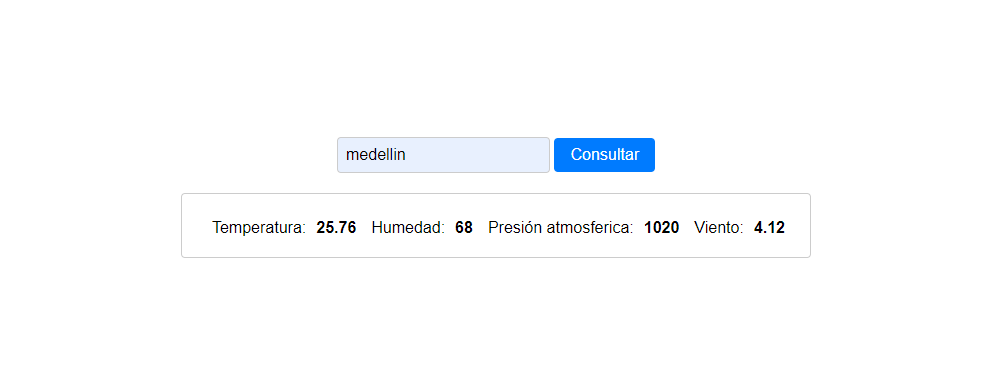

### Deivy Patiño Rodriguez

### WeatherApp

## Descripción
WeatherApp es una aplicación que permite a los usuarios obtener información meteorológica actualizada de diversas ciudades. Utiliza la API de OpenWeatherMap para proporcionar datos precisos sobre la temperatura, humedad, presión atmosférica y velocidad del viento de una ciudad específica.

Esta aplicación está construida con una arquitectura monolítica que combina el front-end y el back-end en una sola aplicación, facilitando la consulta del clima de manera sencilla.

### Arquitectura
El proyecto está basado en una arquitectura monolítica, donde el front-end y el back-end están integrados en una sola aplicación.

### Instalación de Dependencias
Para instalar las dependencias necesarias, ejecuta el siguiente comando:

npm install

### Cómo Ejecutar la Aplicación
Para iniciar la aplicación, utiliza el siguiente comando:

npm start

### Vista Final 

